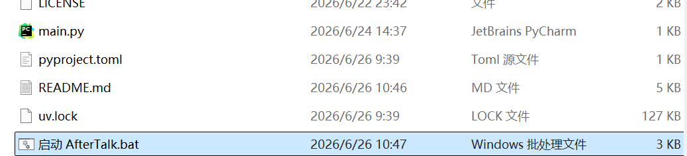
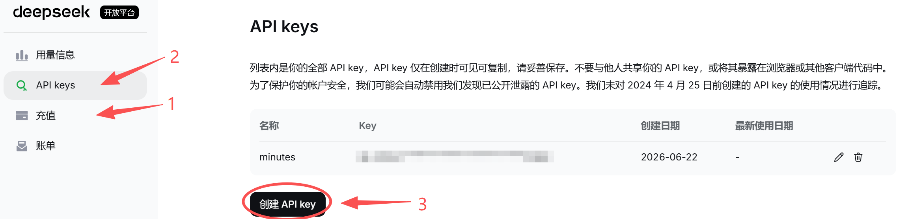
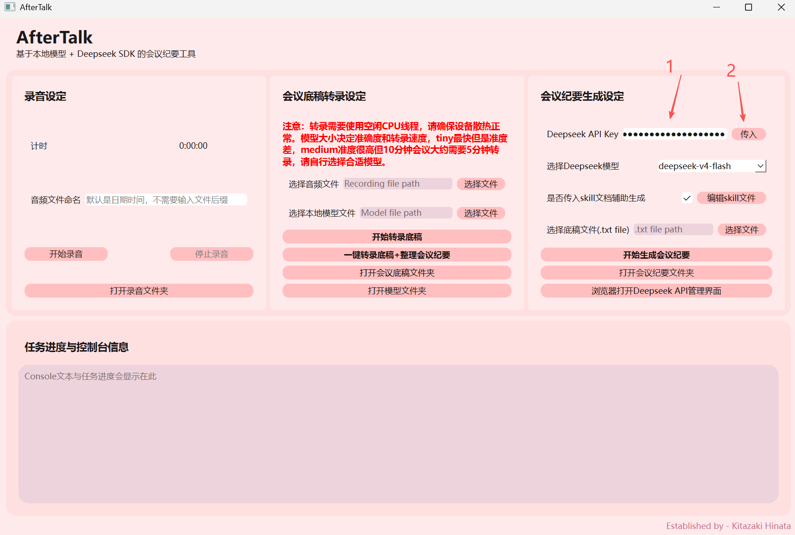
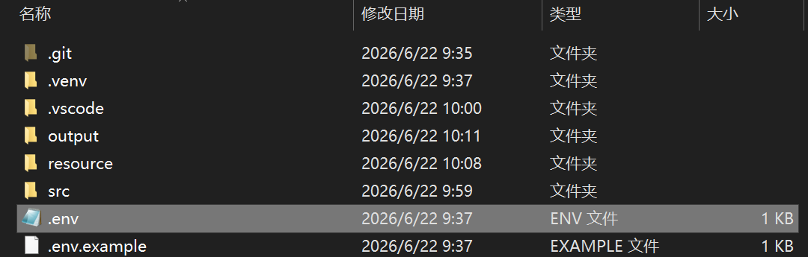

<p align="center">
</p>
<h2 align="center">AfterTalk：AI + minutes</h2>
  <h5 align="center">基于本地模型 + Deepseek SDK 的会议纪要工具</h5>

----


### 一、项目目标
使用whisper cpp模型将会议录音转换为会议底稿（transcript），再通过 Deepseek SDK 对 transcript 进行整理与生成结构化会议纪要。音频输入支持：实时录音或上传已有音频文件（wav与mp3格式 ）。
> [!WARNING]
> 1. 本应用不具备检查设备录音是否正常的功能，请在实际录音之前先**测试录音功能是否正常**（例如，确保设置当中“选择输入设备”选择的是本地麦克风）。
> 2. 录音转换底稿功能需要使用多个CPU空闲线程，需要**保证设备的散热正常**（例：不要在床上转换底稿）
> 3. 录音转换底稿需要按需选择模型，模型文件越大准确度越高，但是所需要的时间越长。（实测：Intel I7-11370H 4核8线程CPU，使用medium模型，40分钟的会议录音，转换耗时共42分钟；预计i9-14900K / Ryzen 9 7950X类CPU进行同类型任务需要8-12分钟）
> 4. 根据精确度要求和预算选择对应的deepseek模型。（实测：10分钟约3300字符的会议底稿，使用v4-flash模型，花费0.02元；40分钟约8300字符的会议底稿，使用v4-pro模型，花费0.06元）
> 5. 强烈建议生成完之后**检查纪要内容**。AI有时无法识别正确的公司名称或者产品名称，需要自行修改。

### 二、主要功能
- 本地录音并保存为标准音频文件（wav/mp3）。
- 使用本地whisper模型将音频转写为文本（transcript）。
- 将 transcript 传给 Deepseek，生成结构化会议纪要并回传给 GUI 展示或导出。

### 三、环境与依赖安装（推荐流程）
1. 使用 Python 3.12 解释器：[点击跳转到download页面](https://www.python.org/downloads/release/python-3120/)
2. 运行```启动AfterTalk.bat``` 自动安装虚拟环境和所需要的依赖，并启动图形界面。
   


3. 按 Deepseek 官方文档安装，充值token并配置 Deepseek SDK（包含 API Key/认证信息）[点击跳转到deepseek页面](https://platform.deepseek.com/usage。)   



4. **传入API KEY** ：两种可选方法
- 在进入应用的图形界面之后，在图片所示的区域粘贴Deepseek API KEY，然后点击传入。应用会自动生成```.env```文件并传入API KEY。


- 或者：在根目录创建一个文件，命名为```.env```，然后使用文本文档的方式打开文件，将等于号```=```后面的字符替换为第三步中deepseek提供的API key：
    ```env
    API_KEY=sk-xxxxxxxxxxxxxxxxxxxxxxxxx
    ```


5. 下载本地whisper语音识别模型，然后将模型放在```resource/model```文件夹当中。 
- [夸克网盘链接，提取码：sT8v](https://pan.quark.cn/s/7a425a06541b)
- [百度网盘链接，提取码：hjpw](https://pan.baidu.com/s/1b-unetzLQpe1Qspj_bg9_A)

6. 【可选】 修改提示词
- 可以选择自定义Deepseek提示词模板，请修改```resource/skill/skill.md```文件。注意不要删除特殊符号，比如“#”等。
- 如果会议**包含特殊行业、产品、公司名称**，请修改```resource/skill/glossary.md```文件，需要参考格式（易出错的名词发音，和正确书写方式）。该文件会尝试帮助AI识别错误名词并修改。


### 四、项目架构
<details>
  <summary>点击查看详情</summary>

```
meeting-minutes-ai/
├── main.py                       # 程序入口：启动 GUI
├── pyproject.toml
├── uv.lock
├── .env                          # DEEPSEEK_API 等密钥存储文件
├── logs
├── src/
│   │
│   ├── config/                   # ── 配置层 ──
│   │   ├── settings.py           # 加载 .env、全局配置（模型路径、采样率等）
│   │   └── paths.py              # 集中管理路径常量
│   │
│   ├── audio/                    # ── 音频模块 ──
│   │   └── recorder.py           # 实时录音，转出文件
│   │
│   ├── whisper/                      # ASR 模型
│   │   └── whisper.py          # 本地模型实现(读取 resource/model/)
│   │
│   ├── llm/                      # ── Deepseek 接入层 ──
│   │   ├── llm_client.py         # Deepseek SDK 客户端封装(重试、超时、错误处理)
│   │   └── prompt.py             # 读取 resource/skill/*.md 构建 system prompt
│   │
│   ├── gui/     
│   │   ├── ui_main.py                  
│   │   ├── ui_function.py               
│   │   └── ui_mainwindow.py        # 主窗口
│   │
│   └── utils/                    # ── 通用工具 ──
│       ├── logger.py             # 统一日志(写到 output/ 或 logs/)
│       ├── word_writer.py        # 生成doc格式的文件
│       └── file_utils.py         # 时间戳文件名、文件清理等
│
├── resource/
│   ├── model/                    # 本地 ASR 模型权重
│   ├── skill/                    # 给 Deepseek 的提示词模板(md)
│   │   └── skill.md
│   └── pictures/
│
└── output/
    ├── recordings/               # 原始音频
    ├── transcript/               # ASR 生成的底稿
    └── minutes/                  # 最终会议纪要
```

</details>
